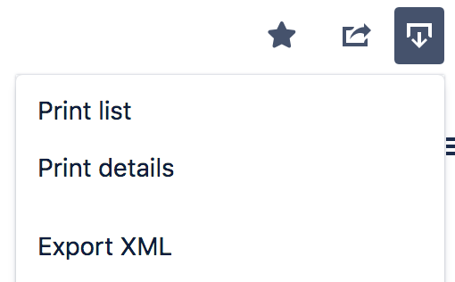
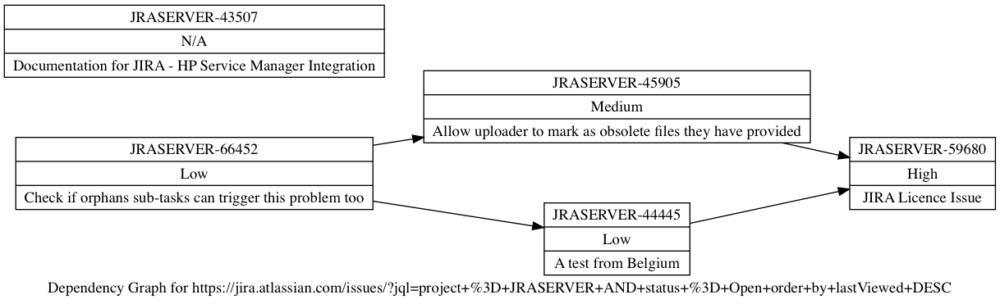

# JIRA Blocker Grapher
Tool to graph JIRA story dependencies by mapping blocker links. Other plugins exist that do this in an easier manner, but this is the only one that's free! 😉

## Usage
1. From a JIRA search, select `Export` -> `Export XML`

1. Command Line: `./block-graph.py /PATH/TO/Jira.xml`

	macOS GUI: Drop XML file onto `JIRA Blocker Grapher.app`
1. The tool will generate a DOT file next to the XML file. ex. if the input file is called `Jira.xml`, the DOT file will be called `Jira.xml.gv`.
1. Open the DOT file with a tool such as [Graphviz](https://www.graphviz.org/) (included) or [OmniGraffle](https://www.omnigroup.com/omnigraffle/). If desired, export as image, PDF, etc.

## Example output

## Build notes
This is a small python 2 script with no depdenencies. The macOS GUI is made using [Platypus](https://sveinbjorn.org/platypus). `.platypus` project file is included but contains absolute paths that will need to be updated to match other machines.